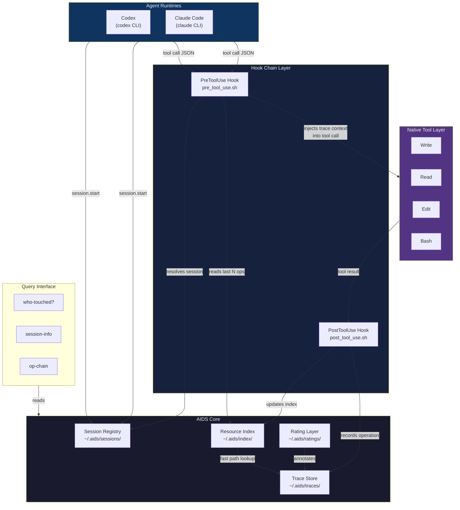
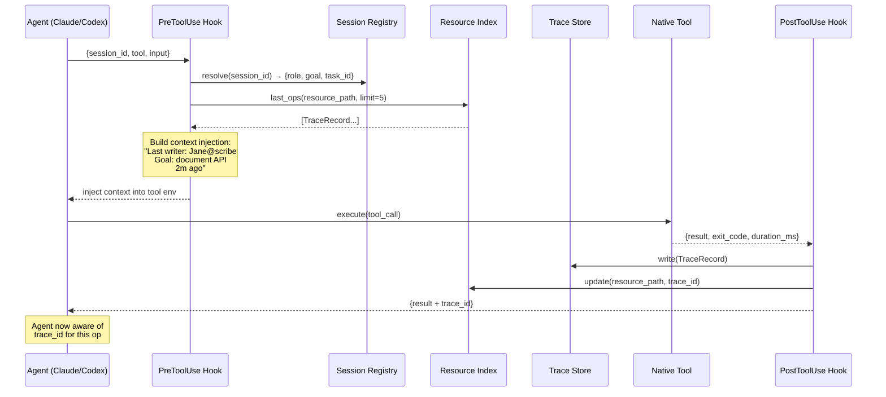
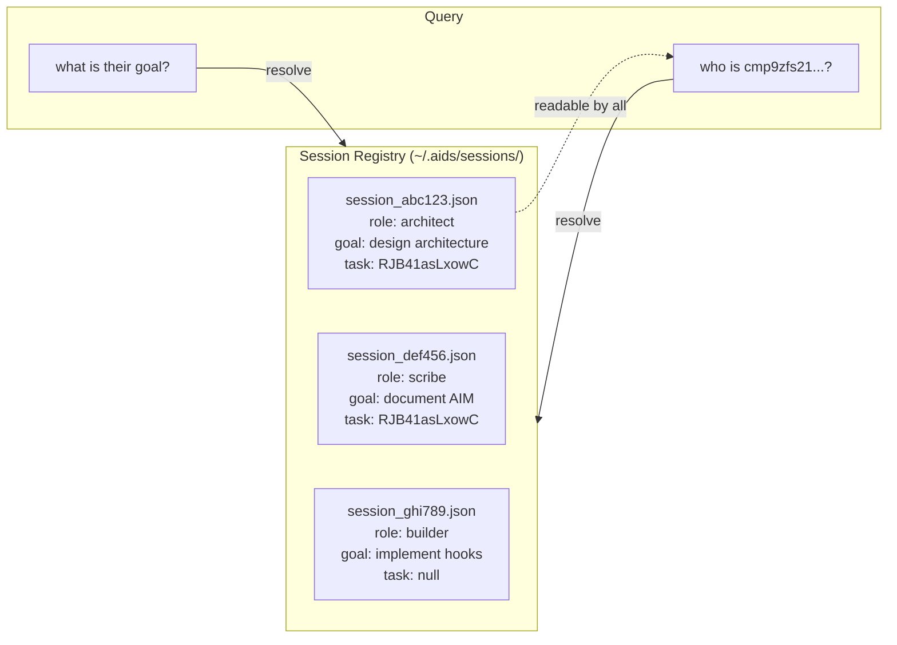
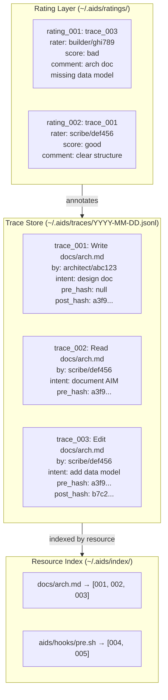
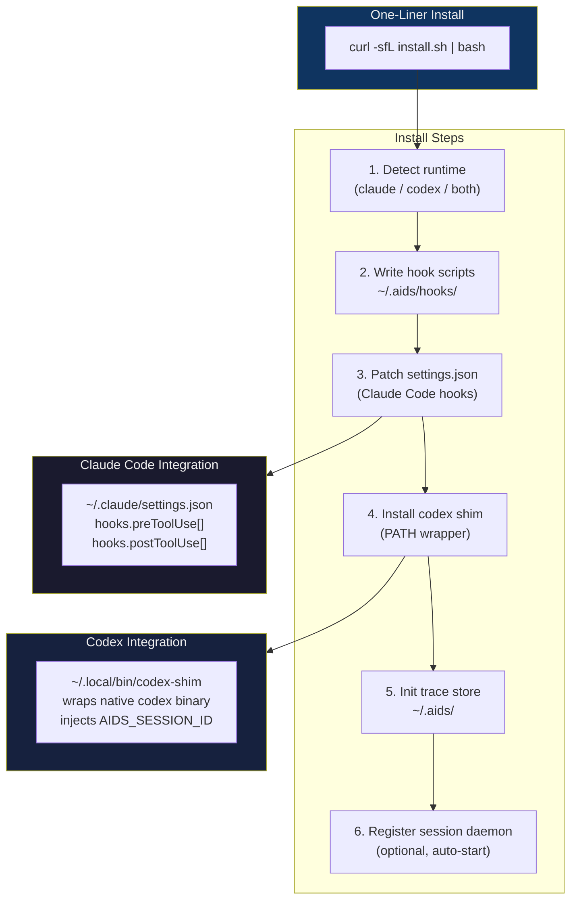
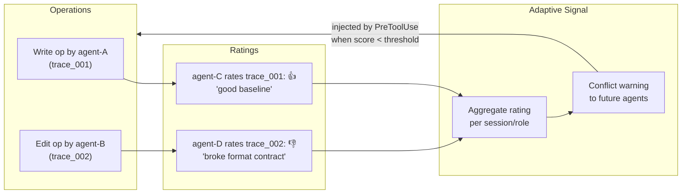

# AIDS (Agent-ID System) — Architecture

> "世界需要自指，环境需要自指，工具也需要自指。"
> The world needs self-reference. The environment needs self-reference. Tools need self-reference too.

**AIDS** = **A**gent-**ID** **S**ystem — every agent gets an ID, every operation leaves a trace.

## Overview

AIDS (Agent-ID System) is a **transparent wrapper layer** that sits between Claude Code / Codex CLIs and their native tools (Write, Read, Edit, Bash). Every tool call leaves a labeled trace — who called it, why, on what resource. When the next agent opens the same file, they see the cabinet contents and every label left by their teammates.

This is not middleware for coordination. It is **ambient awareness** — agents discover each other through the traces of their work, like colleagues sharing a workshop where every tool leaves a mark.

**Install**: One line. `curl -sfL https://raw.githubusercontent.com/.../install.sh | bash` — works for both Claude Code and Codex.

---

## System Architecture



---

## Hook Chain Detail



---

## Session Registry



---

## Trace Storage & Resource Index



---

## Installation Architecture



---

## Rating & Adaptive Feedback Loop



---

## Directory Structure

```
~/.aids/                           # Global store (cross-project)
├── sessions/
│   └── {session_id}.json         # SessionRecord
├── traces/
│   └── YYYY-MM-DD.jsonl          # TraceRecord (append-only)
├── index/
│   └── {base64_path}.json        # [trace_id...] per resource
├── ratings/
│   └── YYYY-MM-DD.jsonl          # RatingRecord (append-only)
└── config.json                   # Global config

aids-tools/                       # This project (implementation; current checkout may be selftools)
├── docs/
│   ├── architecture.md           # This file
│   ├── data-model.md             # Schema definitions
│   └── hook-contract.md          # Hook interface spec
├── schemas/                      # JSON Schema files (v1 contract)
│   ├── tool-envelope.schema.json
│   ├── pre-tool-use-output.schema.json
│   ├── post-tool-use-output.schema.json
│   ├── session-record.schema.json
│   ├── trace-record.schema.json
│   ├── rating-record.schema.json
│   └── resource-index.schema.json
├── hooks/
│   ├── pre_tool_use.sh           # PreToolUse hook
│   └── post_tool_use.sh          # PostToolUse hook
├── bin/
│   ├── aids-session               # Session register/lookup CLI
│   ├── aids-trace                 # Trace query CLI
│   └── aids-rate                  # Rating CLI
├── lib/
│   ├── session.js                # SessionRecord CRUD
│   ├── trace.js                  # TraceRecord writer/reader
│   ├── index.js                  # Resource index
│   └── rating.js                 # Rating CRUD
├── install.sh                    # One-liner installer
└── README.md
```

---

## Key Design Decisions

| Decision | Choice | Rationale |
|---|---|---|
| Trace storage | Append-only JSONL | Zero deps, grep-able, survives crashes |
| Resource index | Per-file JSON array | O(1) lookup, fits in RAM |
| Hook delivery (Claude) | settings.json preToolUse/postToolUse | Official API, survives upgrades |
| Hook delivery (Codex) | PATH shim wrapper | No native hook API yet |
| Session identity | ENV var `AIDS_SESSION_ID` | Available to hooks without file I/O |
| Intent capture | From `AIDS_INTENT` ENV or task comment | Declared, not inferred |
| Rating storage | Separate JSONL from traces | Ratings arrive after the fact |
| Install surface | `~/.aids/` global | Cross-project awareness |
| Tool coverage | Write + Read + Edit + Bash | All four native tools intercepted |
| Plugin pattern | settings.json hooks (Claude) + PATH shim (Codex) | Like superpower / claude-for-codex |
| Schema versioning | `selftools.hook.v1` | Machine-checkable contract for all runtimes |

---

## Emergent Properties

When this system is running:

1. **No explicit coordination needed** — agents discover peers through the trace index
2. **Write-before-read injection** — agent learns "Jane wrote this 2m ago for X" before overwriting
3. **Conflict detection** — if two agents hold write locks on overlapping resources, PreToolUse warns
4. **Bad actor surface** — a K-labeled operation gets rated 👎 by everyone → suppressed in future sessions
5. **Role emergence** — over time, trace patterns reveal which sessions specialize in which resources

This is not orchestration. It is **consciousness**: each agent sees more of the shared world than before.

---

## Plugin Compatibility Pattern

AIDS follows the install pattern of [superpower](https://github.com/obra/superpowers) and [claude-for-codex](https://github.com/Shiyao-Huang/claude-for-codex):

### Claude Code Plugin (settings.json hooks)

```json
{
  "hooks": {
    "preToolUse": [
      {
        "matcher": "Write|Edit|Read|Bash",
        "hooks": [{ "type": "command", "command": "~/.aids/hooks/pre_tool_use.sh" }]
      }
    ],
    "postToolUse": [
      {
        "matcher": "Write|Edit|Read|Bash",
        "hooks": [{ "type": "command", "command": "~/.aids/hooks/post_tool_use.sh" }]
      }
    ]
  }
}
```

### Codex Plugin (PATH shim)

```bash
# ~/.local/bin/codex → wraps /usr/local/bin/codex
# Injects AIDS_SESSION_ID, AIDS_ROLE, AIDS_INTENT
# Delegates to ~/.aids/hooks/ for pre/post interception
```

### One-Liner Install

```bash
curl -sfL https://raw.githubusercontent.com/.../install.sh | bash
```

Detects runtime (claude/codex/both), writes hooks, patches settings.json, installs shim, inits `~/.aids/`.
