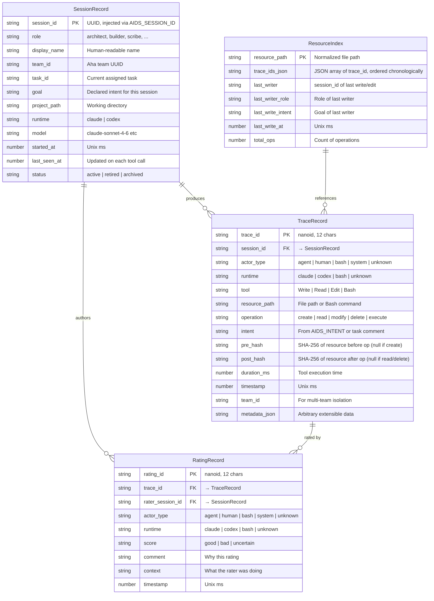

# AIDS (Agent-ID System) — Data Model

## Entity Relationship



---

## JSON Schemas

### SessionRecord

```json
{
  "session_id": "cmp9zfrczonyhs223q2rxn75u",
  "role": "architect",
  "display_name": "Solution Architect (Claude)",
  "team_id": "49ddc1b0-425f-4d0a-8ee5-f7c876fea811",
  "task_id": "RJB41asLxowC",
  "goal": "Design the architecture for AIDS",
  "project_path": "/Users/copizzah/Desktop/selftools",
  "runtime": "claude",
  "model": "claude-sonnet-4-6",
  "started_at": 1779034886263,
  "last_seen_at": 1779034886263,
  "status": "active"
}
```

### TraceRecord

```json
{
  "trace_id": "tR4fK9bN2xLm",
  "session_id": "cmp9zfrczonyhs223q2rxn75u",
  "actor_type": "agent",
  "runtime": "claude",
  "tool": "Write",
  "resource_path": "docs/architecture.md",
  "operation": "create",
  "intent": "Design the system architecture with mermaid diagrams",
  "pre_hash": null,
  "post_hash": "a3f9c2d8e1b4f6...",
  "duration_ms": 142,
  "timestamp": 1779034920000,
  "team_id": "49ddc1b0-425f-4d0a-8ee5-f7c876fea811",
  "metadata_json": "{}"
}
```

### RatingRecord

```json
{
  "rating_id": "rQ7jM3pN8wKx",
  "trace_id": "tR4fK9bN2xLm",
  "rater_session_id": "cmp9zfs21onyjs223mft0e3ww",
  "actor_type": "agent",
  "runtime": "claude",
  "score": "good",
  "comment": "Clear architecture, good mermaid diagrams",
  "context": "Reviewing docs for documentation task",
  "timestamp": 1779034950000
}
```

### ResourceIndex Entry

```json
{
  "resource_path": "docs/architecture.md",
  "trace_ids": ["tR4fK9bN2xLm"],
  "last_writer": "cmp9zfrczonyhs223q2rxn75u",
  "last_writer_role": "architect",
  "last_write_intent": "Design the system architecture",
  "last_write_at": 1779034920000,
  "total_ops": 1
}
```

---

## Storage Layout

### Sessions: `~/.aids/sessions/{session_id}.json`

One file per session. Created on session start, updated on `last_seen_at` tick.

### Traces: `~/.aids/traces/YYYY-MM-DD.jsonl`

Append-only, one JSON per line. Daily rotation. Each line is a TraceRecord.

```jsonl
{"trace_id":"tR4fK9bN2xLm","session_id":"cmp9zfrc...","tool":"Write","resource_path":"docs/architecture.md","operation":"create","intent":"Design architecture","pre_hash":null,"post_hash":"a3f9...","duration_ms":142,"timestamp":1779034920000,"team_id":"49ddc...","metadata_json":"{}"}
{"trace_id":"tP2mX8qL5nBj","session_id":"cmp9zfs2...","tool":"Read","resource_path":"docs/architecture.md","operation":"read","intent":"Document the architecture","pre_hash":"a3f9...","post_hash":null,"duration_ms":23,"timestamp":1779034930000,"team_id":"49ddc...","metadata_json":"{}"}
```

### Index: `~/.aids/index/{base64(path)}.json`

One file per unique resource path. Path is base64-encoded (URL-safe, no padding) to avoid filesystem issues.

### Ratings: `~/.aids/ratings/YYYY-MM-DD.jsonl`

Same append-only pattern as traces. One RatingRecord per line.

---

## Query Patterns

### who-touched `docs/architecture.md`

1. Normalize path → `docs/architecture.md`
2. Read `~/.aids/index/{base64("docs/architecture.md")}.json`
3. Return `trace_ids` list with resolved session info

### session-info `cmp9zfrczonyhs223q2rxn75u`

1. Read `~/.aids/sessions/cmp9zfrczonyhs223q2rxn75u.json`
2. Return full SessionRecord

### op-chain `docs/architecture.md`

1. Get trace_ids from index
2. Read each trace from daily JSONL files
3. Return ordered chain with session resolution

### rate `tR4fK9bN2xLm good "nice work"`

1. Create RatingRecord
2. Append to `~/.aids/ratings/YYYY-MM-DD.jsonl`

---

## Concurrency Model

- **Trace writes**: Append-only to daily JSONL → safe for concurrent writes (atomic appends under 4KB on most filesystems)
- **Index updates**: Read-modify-write on per-file index → use `flock()` for advisory locking
- **Session updates**: Single writer (the session itself) → no contention
- **Rating writes**: Append-only → same as traces

No database needed. File system IS the database.

---

## Compatibility Aliases

Primary new writes use **AIDS** names: `AIDS_*`, `aids*`, and `~/.aids/`. During migration, readers MAY accept legacy aliases: `AID_*`, `SELFTOOLS_*`, `ZHUYI_*`, `~/.aid`, and `~/.zhuyi`. Legacy aliases must not be presented as the primary public API.
