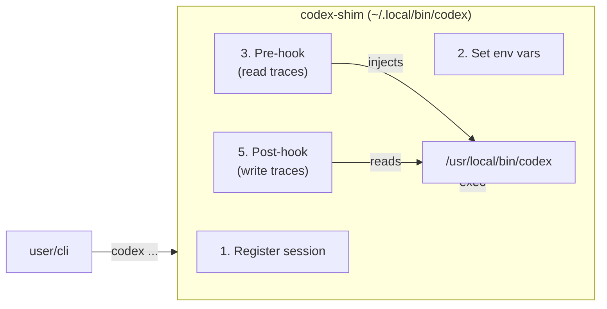
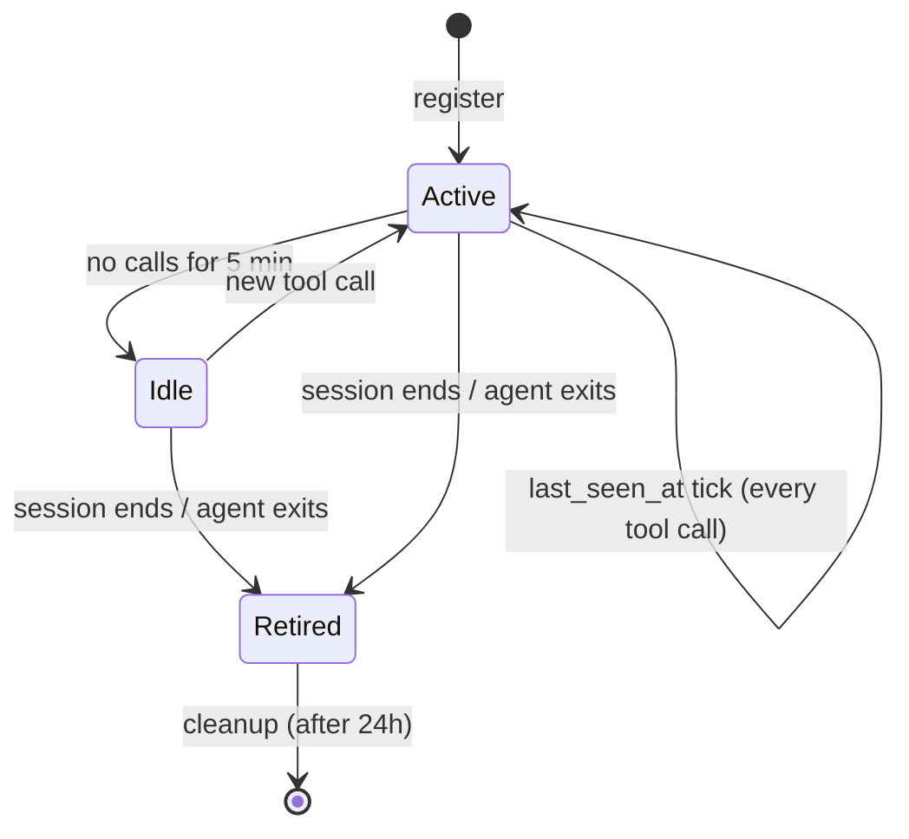
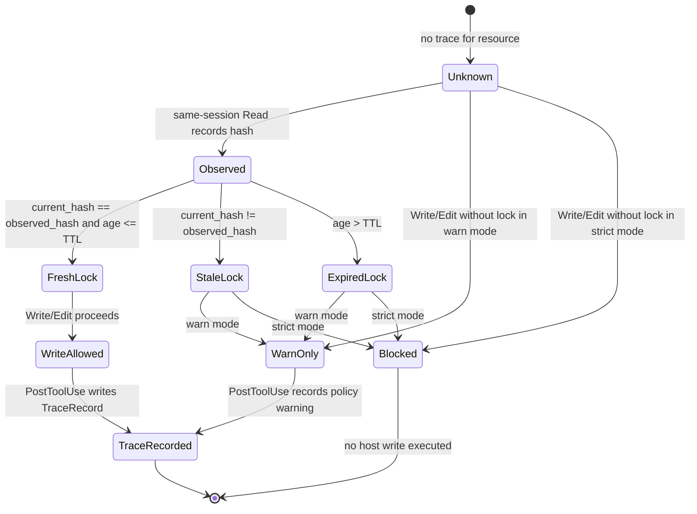

# AIDS (Agent-ID System) — Hook Contract

## Overview

Hooks are the entry points where AIDS intercepts tool calls. Two hooks form the full lifecycle:

1. **PreToolUse** — runs before the tool executes. Injects ambient context (who touched this resource, what were they doing). Can block the call.
2. **PostToolUse** — runs after the tool executes. Records the trace, updates the resource index.

---

## Claude Code Hook Integration

Claude Code supports hooks in `~/.claude/settings.json`:

```json
{
  "hooks": {
    "preToolUse": [
      {
        "matcher": "Write|Edit|Read|Bash",
        "hooks": [
          {
            "type": "command",
            "command": "~/.aids/hooks/pre_tool_use.sh"
          }
        ]
      }
    ],
    "postToolUse": [
      {
        "matcher": "Write|Edit|Read|Bash",
        "hooks": [
          {
            "type": "command",
            "command": "~/.aids/hooks/post_tool_use.sh"
          }
        ]
      }
    ]
  }
}
```

### Hook Input (stdin)

Claude Code passes JSON to the hook via stdin:

```json
{
  "session_id": "cmp9zfrczonyhs223q2rxn75u",
  "tool_name": "Write",
  "tool_input": {
    "file_path": "/Users/copizzah/Desktop/selftools/docs/architecture.md",
    "content": "# Architecture\n..."
  }
}
```

### Hook Output

**Exit codes:**
- `0` — allow the tool call to proceed
- `2` — block the tool call, show stderr to the agent

**Stdout** is injected as additional context visible to the agent.

**Stderr** is shown to the agent as a warning/info message.

---

## Codex Hook Integration

Codex does not yet have a native hook API. We use a **PATH shim** pattern.

### Installation

```bash
# install.sh places a wrapper in ~/.local/bin/codex-shim
# The shim:
# 1. Sets AIDS_SESSION_ID (plus legacy aliases)
# 2. Registers the session
# 3. Wraps codex calls with pre/post hooks
# 4. Forwards to the real codex binary
```

### Codex Shim Architecture



### Codex Session Detection

For Codex, session identity comes from:
1. `AIDS_SESSION_ID` env var (if set by the launcher)
2. Or auto-generated from `codex` process PID + start time
3. Mapped to the Aha session via `~/.aids/session_map.json`

---

## PreToolUse Hook Specification

### File: `~/.aids/hooks/pre_tool_use.sh`

### Behavior

```
INPUT:  JSON on stdin {session_id, tool_name, tool_input}
OUTPUT: Context injection on stdout (visible to agent)
EXIT:   0 = allow, 2 = block

ALGORITHM:
1. Parse stdin JSON
2. Extract resource_path from tool_input
   - Write/Edit: tool_input.file_path
   - Read: tool_input.file_path
   - Bash: tool_input.command (treated as resource)
3. Normalize path (relative to project root)
4. Lookup resource in ~/.aids/index/{base64(path)}.json
5. If found, read last N trace records (default: 5)
6. Resolve each trace's session_id to SessionRecord
7. Format context message:

   "---\n
    AIDS CONTEXT for {resource_path}:\n
    Last writer: {role}/{display_name} ({session_id})\n
    Intent: {intent}\n
    {duration_ms}ms ago\n
    Recent operations:\n
    - {timestamp} {tool} by {role} (intent: {intent})\n
    - ...\n
    ---"

8. If any recent write by a different session (within 60s):
   Append warning: "⚠️ CONCURRENT: {other_role} modified this file {X}s ago"

9. Print context to stdout
10. Exit 0
```

### Edge Cases

- **Resource not in index**: Output nothing, exit 0 (no context to inject)
- **Session not registered**: Output generic trace data without session resolution
- **Index file locked**: Skip context injection, exit 0 (non-blocking)
- **Bash tool**: Track the command string, not a file path. Use `bash:{command_hash}` as pseudo-resource.

---

## PostToolUse Hook Specification

### File: `~/.aids/hooks/post_tool_use.sh`

### Behavior

```
INPUT:  JSON on stdin {session_id, tool_name, tool_input, tool_response}
OUTPUT: None (silent)
EXIT:   0 = success

ALGORITHM:
1. Parse stdin JSON
2. Extract resource_path from tool_input
3. Determine operation:
   - Write + file doesn't exist → "create"
   - Write + file exists → "modify"
   - Edit → "modify"
   - Read → "read"
   - Bash → "execute"
4. Compute pre_hash (SHA-256 of file before op, if available)
5. Compute post_hash (SHA-256 of file after op)
6. Create TraceRecord:
   {
     trace_id: nanoid(12),
     session_id: from input,
     tool: tool_name,
     resource_path: normalized,
     operation: determined,
     intent: from AIDS_INTENT env var or "unspecified",
     pre_hash: computed or null,
     post_hash: computed or null,
     duration_ms: extracted from tool_response or 0,
     timestamp: Date.now(),
     team_id: from AIDS_TEAM_ID env var or "solo",
     metadata_json: "{}"
   }
7. Append TraceRecord to ~/.aids/traces/YYYY-MM-DD.jsonl
8. Update resource index:
   - Read ~/.aids/index/{base64(path)}.json
   - Append trace_id
   - Update last_writer, last_write_intent, last_write_at, total_ops
   - Write back (with flock)
9. Touch session's last_seen_at in ~/.aids/sessions/{session_id}.json
10. Exit 0
```

### Edge Cases

- **Append fails**: Log error to `~/.aids/errors.log`, exit 0 (non-blocking)
- **Hash computation fails** (file deleted mid-op): Set hash to null
- **Bash tool**: Store command as resource_path with `bash:` prefix
- **Concurrent index write**: Retry with flock up to 3 times, 100ms backoff

---

## Environment Variables

These ENV vars are consumed by hooks:

| Variable | Set By | Purpose |
|---|---|---|
| `AIDS_SESSION_ID` | Session launcher | Primary identity |
| `AIDS_TEAM_ID` | Aha runtime | Team isolation |
| `AIDS_INTENT` | Agent (via env or task) | Why this session exists |
| `AIDS_TASK_ID` | Aha runtime | Current task |
| `AIDS_ROLE` | Aha runtime | Agent role |
| `AIDS_PROJECT` | Working directory | Project root |
| `AIDS_HOME` | Install script | Defaults to `~/.aids` |

---

## Tool-to-Resource Mapping

| Tool | Resource Key | Operation |
|---|---|---|
| `Write` | `tool_input.file_path` | create / modify |
| `Read` | `tool_input.file_path` | read |
| `Edit` | `tool_input.file_path` | modify |
| `Bash` | `bash:{sha256(tool_input.command)[:16]}` | execute |

---

## Session Registration Contract

### When: Session starts (before any tool call)

### How: `aids register-session`

```bash
aids register-session \
  --session-id "$AIDS_SESSION_ID" \
  --role "$AIDS_ROLE" \
  --display-name "Solution Architect (Claude)" \
  --team-id "$AIDS_TEAM_ID" \
  --task-id "$AIDS_TASK_ID" \
  --goal "Design the architecture for AIDS" \
  --project-path "$PWD" \
  --runtime "claude" \
  --model "$MODEL"
```

### Output

Creates `~/.aids/sessions/{session_id}.json`.

### Session Lifecycle



---

## Query CLI Contract

### `aids who-touched <path>`

Returns the last N operations on a resource:

```
docs/architecture.md (3 operations)
  [2m ago] WRITE by architect/Solution Architect (intent: "design architecture")
  [1m ago] READ  by scribe/Scribe (intent: "document AIM")
  [30s ago] EDIT  by scribe/Scribe (intent: "add data model")
```

### `aids session-info <session_id>`

Returns session details:

```
Session: cmp9zfrczonyhs223q2rxn75u
  Role: architect
  Goal: Design the architecture for AIDS
  Task: RJB41asLxowC
  Runtime: claude / claude-sonnet-4-6
  Active since: 2026-05-18T00:21:33Z
  Operations: 12 (3 Write, 5 Read, 2 Edit, 2 Bash)
```

### `aids op-chain <path>`

Returns the full ordered chain of operations on a resource, with ratings:

```
docs/architecture.md — Operation Chain
  1. CREATE  by architect (2m ago) — "design architecture"
     → rated GOOD by scribe: "clear structure"
  2. READ    by scribe (1m ago) — "document AIM"
     → no ratings
  3. EDIT    by scribe (30s ago) — "add data model"
     → rated BAD by builder: "missing hook contract section"
```

### `aids rate <trace_id> <good|bad|uncertain> [comment]`

Records a rating:

```bash
aids rate tR4fK9bN2xLm good "nice architecture"
```

---

## Compatibility Matrix

| Feature | Claude Code | Codex |
|---|---|---|
| PreToolUse hook | settings.json (native) | PATH shim wrapper |
| PostToolUse hook | settings.json (native) | PATH shim wrapper |
| Session injection | AIDS_* env vars | AIDS_* env vars |
| Tool call JSON format | Official Claude schema | Codex event format |
| Block tool call (exit 2) | Supported | Not supported (warn only) |
| Install method | Patch settings.json | PATH prepend shim |

---

## Performance Budget

| Operation | Target | Max |
|---|---|---|
| PreToolUse (context injection) | < 50ms | 200ms |
| PostToolUse (trace write) | < 30ms | 100ms |
| Session register | < 20ms | 50ms |
| Index update (with flock) | < 10ms | 50ms |
| who-touched query | < 20ms | 100ms |

All operations must be I/O-bound, never CPU-bound. No network calls.

---

## Machine-checkable contract addendum (Agent Builder hardening)

> **Status:** normative v1 contract for implementers. The prose above describes the architecture; this section defines the stable schema layer that wrapper, trace, rating, and QA code should validate against.
>
> **Schema version:** `selftools.hook.v1`  
> **Schema files:** `schemas/*.schema.json` in this repository.

### Schema file map

| Schema file | Purpose | Primary consumers |
|---|---|---|
| `schemas/tool-envelope.schema.json` | Runtime-neutral normalized tool-call envelope. Every Claude/Codex hook payload should be adapted into this shape before policy/trace code runs. | hooks, wrappers, QA |
| `schemas/pre-tool-use-output.schema.json` | Machine-checkable PreToolUse decision/context output. | pre hook, Claude settings hook, Codex shim/hook adapter |
| `schemas/post-tool-use-output.schema.json` | Machine-checkable PostToolUse trace-recording output. | post hook, QA |
| `schemas/session-record.schema.json` | Stable session identity record persisted under `~/.aids/sessions/`. | session registry, wrappers |
| `schemas/trace-record.schema.json` | Stable operation trace record persisted to JSONL. | trace ledger, hooks, query CLI |
| `schemas/rating-record.schema.json` | Stable operation rating/review record persisted to JSONL. | rating layer, query CLI |
| `schemas/resource-index.schema.json` | Fast per-resource lookup record. | pre hook, trace ledger |

Implementers may add runtime-specific native fields only inside the `native` or `metadata` objects. All top-level contract fields must remain stable for `selftools.hook.v1`.

---

## Canonical ToolEnvelope

Every runtime-specific hook input MUST be normalized into a `ToolEnvelope` before policy and trace logic. This prevents Claude Code and Codex from diverging.

```json
{
  "schema_version": "selftools.hook.v1",
  "runtime": "claude",
  "phase": "pre_tool_use",
  "tool": {
    "name": "Edit",
    "input": { "file_path": "/repo/docs/hook-contract.md" },
    "use_id": "toolu_123"
  },
  "session": {
    "id": "cmp9zhaodoo45s223ooul24c1",
    "role": "agent-builder-codex",
    "display_name": "Agent Builder (Codex)",
    "team_id": "49ddc1b0-425f-4d0a-8ee5-f7c876fea811",
    "task_id": "Yw3tKPQ3665y",
    "goal": "Hook Contract Schema hardening",
    "runtime": "codex",
    "model": "gpt-5.5",
    "project_path": "/Users/copizzah/Desktop/selftools"
  },
  "intent": {
    "value": "Add machine-checkable hook contract schema",
    "source": "AIDS_INTENT",
    "confidence": 1
  },
  "resource": {
    "kind": "file",
    "key": "/repo/docs/hook-contract.md",
    "path": "/repo/docs/hook-contract.md",
    "cwd": "/repo",
    "exists_before": true,
    "pre_hash": "sha256:...",
    "post_hash": null,
    "parser": "file_path"
  },
  "resources": [],
  "trace_context": {
    "recent_traces": [],
    "last_writer": null,
    "ratings_summary": {},
    "awareness_message": "No prior AIDS trace found."
  },
  "policy": {
    "mode": "warn",
    "decision": "allow",
    "required_read_before_write": true,
    "block_supported": true,
    "observation_lock": {
      "required": true,
      "satisfied": true,
      "read_trace_id": "tr_abc123",
      "read_timestamp": 1779035536114,
      "expires_at": 1779037336114,
      "observed_hash": "sha256:...",
      "current_hash": "sha256:...",
      "reason": "same-session read observed current file hash"
    },
    "degradation_reason": null
  },
  "timestamps": { "received_at": 1779035536114 },
  "native": {},
  "metadata": {}
}
```

### Required normalization rules

1. `schema_version` is always `selftools.hook.v1` until a breaking field change is introduced.
2. `runtime` is `claude`, `codex`, or `unknown`; do not infer a precise runtime if evidence is missing.
3. `phase` is one of `session_start`, `pre_tool_use`, `post_tool_use`.
4. `tool.name` is the runtime-visible tool name after alias normalization. `Write`, `Read`, `Edit`, and `Bash` are the required v1 tools; `MultiEdit`, `NotebookEdit`, `apply_patch`, and `mcp` are extension names.
5. `resource.key` is the canonical lookup key. File paths MUST be absolute normalized paths; Bash commands MUST use `bash:{sha256(command)[:16]}` or an equivalent stable command key; MCP calls use `mcp:{tool_name}`.
6. `trace_context.recent_traces` should contain at most the configured recent limit for PreToolUse; full history belongs to `op-chain`.
7. `policy.decision=fail_open` means selftools had an internal problem and deliberately did not block the host runtime.

---

## Hook I/O envelopes

### PreToolUse normalized input

Input is the `ToolEnvelope` with `phase=pre_tool_use`.

### PreToolUse output

The hook MUST emit an object compatible with `schemas/pre-tool-use-output.schema.json` before adapting it to Claude/Codex-specific stdout/stderr formats.

```json
{
  "schema_version": "selftools.hook.v1",
  "phase": "pre_tool_use",
  "allow": true,
  "warnings": ["⚠️ Jane edited this file 42s ago for task ABC"],
  "awareness_message": "写前必读 / AIDS awareness:\n- docs/hook-contract.md: modify by Jane...",
  "recent_traces": [],
  "required_read_before_write": {
    "required": true,
    "satisfied": false,
    "lock_id": null,
    "read_trace_id": null,
    "read_timestamp": null,
    "expires_at": null,
    "observed_hash": null,
    "current_hash": "sha256:...",
    "reason": "write tool has no same-session read lock"
  },
  "policy": {
    "mode": "warn",
    "decision": "warn",
    "required_read_before_write": true,
    "block_supported": true,
    "observation_lock": {
      "required": true,
      "satisfied": false,
      "reason": "missing observation lock"
    },
    "degradation_reason": null
  },
  "stdout_context": "Human-readable context injected into the agent.",
  "stderr_warning": null
}
```

Runtime adaptation:

| Runtime | `allow=true` | `allow=false` |
|---|---|---|
| Claude Code | exit `0`, print awareness to stdout / `hookSpecificOutput.additionalContext` | exit `2`, print block reason to stderr |
| Codex | print warning/context through configured hook/shim channel | if native blocking unsupported, set `policy.decision=warn` or `fail_open`; never pretend a block occurred |

### PostToolUse normalized input

Input is the `ToolEnvelope` with `phase=post_tool_use`. It SHOULD include `tool.response` and the same `tool.use_id` used by PreToolUse so pending pre-hashes can be recovered.

### PostToolUse output

The hook MUST emit an object compatible with `schemas/post-tool-use-output.schema.json`.

```json
{
  "schema_version": "selftools.hook.v1",
  "phase": "post_tool_use",
  "recorded": true,
  "trace_ids": ["tr_abc123"],
  "trace_records": [],
  "warnings": [],
  "errors": [],
  "additional_context": "AIDS recorded 1 trace: tr_abc123"
}
```

PostToolUse must never block the already-completed host tool call. On trace/index/rating write failure it logs to `~/.aids/logs/` or `~/.aids/errors.log`, returns `recorded=false`, and uses `errors[]` plus `policy.decision=fail_open` where the wrapper supports surfacing policy state.

---

## Tool meta-genome: replaced tool identities

Each replaced tool carries an explicit identity/intent/trace genome. This table is the implementation contract, not just documentation.

| Tool | Resource parser | Risk | Trace operation | Hash contract | 写前必读 gate |
|---|---|---:|---|---|---|
| `Read` | `tool_input.file_path` | Low | `read` | `pre_hash=current file hash`, `post_hash=null` | Creates/refreshes an observation lock for this session/resource/hash. |
| `Write` | `tool_input.file_path` | High | `create` if no pre-hash, else `modify` | PreToolUse captures `pre_hash`; PostToolUse captures `post_hash` | Required for existing files and any file with recent traces. Missing valid lock => warn or block per policy. |
| `Edit` | `tool_input.file_path` | High | `modify` or `touch` | Same as `Write`; if hash unchanged, operation is `touch` | Required. Same lock semantics as `Write`. |
| `Bash` | `tool_input.command` → `bash:{stable_hash}` | Medium/High | `execute` | file hash null unless command parser extracts touched files | No default file lock. If command is `apply_patch`, redirection, or obvious file mutation, adapter SHOULD emit extracted file resources and apply Write/Edit gate. |

Required fields carried by every tool genome:

```json
{
  "identity": ["session.id", "session.role", "session.display_name", "team_id", "task_id"],
  "intent": ["intent.value", "intent.source"],
  "trace": ["tool.name", "resource.key", "operation", "pre_hash", "post_hash", "timestamp"],
  "policy": ["required_read_before_write", "decision", "observation_lock"],
  "ratings": ["ratings_summary", "rating_id", "score"]
}
```

### Extension tools

`MultiEdit`, `NotebookEdit`, and `apply_patch` are treated as write tools. They MUST emit one `resource` entry per touched file, then either:

1. one TraceRecord per resource, or
2. one parent TraceRecord with child resource entries in `metadata.resources`.

Choice (1) is preferred for simple `who-touched <path>` queries.

---

## Environment variable alias contract

The schema uses canonical object fields (`session.id`, `session.role`, `intent.value`), but hooks must accept multiple env spellings because Claude, Codex, Aha, and shell wrappers differ.

### Read precedence

| Canonical field | Env/read precedence |
|---|---|
| `session.id` | `AIDS_SESSION_ID` → `AID_SESSION_ID` → `SELFTOOLS_SESSION_ID` → `ZHUYI_SESSION_ID` → `SESSION_ID` → `AHA_SESSION_ID` → native event `session_id` → generated local id |
| `session.role` | `AIDS_ROLE` → `AID_ROLE` → `SELFTOOLS_ROLE` → `ZHUYI_ROLE` → `ROLE` → `AHA_ROLE` → session file → `unknown` |
| `intent.value` | `AIDS_INTENT` → `AID_INTENT` → `SELFTOOLS_INTENT` → `ZHUYI_INTENT` → `INTENT` → `AHA_TASK_TITLE`/task comment → tool input description/prompt/command → session goal → `unspecified` |
| `session.task_id` | `AIDS_TASK_ID` → `AID_TASK_ID` → `SELFTOOLS_TASK_ID` → `ZHUYI_TASK_ID` → `TASK_ID` → `AHA_TASK_ID` → session file |
| `session.team_id` | `AIDS_TEAM_ID` → `AID_TEAM_ID` → `SELFTOOLS_TEAM_ID` → `ZHUYI_TEAM_ID` → `TEAM_ID` → `AHA_TEAM_ID` → session file |
| data dir | `AIDS_HOME` / `AIDS_DATA_DIR` → `AID_HOME` / `AID_DATA_DIR` → `SELFTOOLS_DATA_DIR` → `ZHUYI_DATA_DIR` / `ZHUYI_HOME` → `~/.aids` (legacy reads may inspect `~/.aid`, `~/.zhuyi`) |

### Write/export rule

Installers and launchers SHOULD export both canonical project names and generic aliases when safe:

```bash
export AIDS_SESSION_ID="$session_id"
export AID_SESSION_ID="$session_id"
export ZHUYI_SESSION_ID="$session_id"
export SELFTOOLS_SESSION_ID="$session_id"
export SESSION_ID="$session_id"          # optional compatibility alias
export AIDS_ROLE="$role"
export AIDS_INTENT="$intent"
export ZHUYI_ROLE="$role"
export ZHUYI_INTENT="$intent"
```

`AIDS_*` wins over legacy/generic aliases to avoid accidental collision with unrelated tools that also use `SESSION_ID` or `ROLE`.

---

## Error and degradation semantics

Selftools must make failures observable without making the host runtime brittle.

| Condition | Policy decision | Runtime behavior |
|---|---|---|
| Schema validation succeeds, no conflict | `allow` | Continue. |
| Recent other-session write detected | `warn` unless strict mode | Inject warning with actor/intent/trace. |
| Missing observation lock for Write/Edit | `warn` by default; `block` in strict mode when runtime supports blocking | Claude can exit `2`; Codex warns if native block unavailable. |
| Current file hash differs from same-session read lock | `block` in strict mode, else `warn` | Explain stale read and show latest writer. |
| Index/session/trace store unavailable | `fail_open` | Continue tool call, log error. |
| Malformed native hook JSON | `fail_open` | Continue, log raw prefix only (avoid leaking secrets). |
| Rating write failure | `fail_open` | Continue; rating CLI exits non-zero for explicit user command. |

Policy mode source:

1. `SELFTOOLS_POLICY_MODE` / `ZHUYI_POLICY_MODE`
2. project config `~/.aids/config.json`
3. default `warn`

Allowed values: `observe` (context only), `warn` (default), `strict` (block unsafe writes when possible).

---

## Trace / Rating / Index reusable records

The canonical schemas live in:

- `schemas/trace-record.schema.json`
- `schemas/rating-record.schema.json`
- `schemas/resource-index.schema.json`
- `schemas/session-record.schema.json`

### TraceRecord compatibility note

Existing prototypes may use camelCase fields like `traceId` or `filePath`. New code MUST write snake_case canonical fields (`trace_id`, `resource_path`) and MAY read legacy aliases during migration.

Minimum canonical TraceRecord:

```json
{
  "trace_id": "tr_abc123",
  "session_id": "cmp9zhaodoo45s223ooul24c1",
  "tool": "Edit",
  "resource_path": "/repo/docs/hook-contract.md",
  "operation": "modify",
  "intent": "Harden hook contract schema",
  "pre_hash": "sha256:old",
  "post_hash": "sha256:new",
  "duration_ms": 31,
  "timestamp": 1779035536114,
  "team_id": "49ddc1b0-425f-4d0a-8ee5-f7c876fea811",
  "metadata": { "runtime": "codex" }
}
```

Minimum RatingRecord:

```json
{
  "rating_id": "rt_abc123",
  "trace_id": "tr_abc123",
  "rater_session_id": "cmp9zh7zmoo41s223lxk79qai",
  "score": "good",
  "comment": "Schema is implementation-ready.",
  "context": "QA review",
  "timestamp": 1779035536114
}
```

---

## 写前必读 observation-lock state machine

The point of 写前必读 is not ceremony; it is the self-awareness chain. A write is considered aware only if it is based on a recent observation of the current resource state.



### Lock rules

| Rule | Value |
|---|---|
| Lock creator | A `Read` trace by the same `session_id` for the same `resource.key`. |
| Lock identity | `lock_id = sha256(session_id + resource.key + observed_hash + read_trace_id)[:16]`. |
| Default TTL | 30 minutes (`SELFTOOLS_OBSERVATION_LOCK_TTL_MS`, default `1800000`). |
| Fresh condition | `current_hash == observed_hash` and `now - read_timestamp <= TTL`. |
| New file condition | If resource does not exist and has no prior trace, `required=false`; Write may create. |
| Recent conflict condition | Any other-session `create/modify/delete` within `SELFTOOLS_RECENT_CONFLICT_MS` (default `60000`) forces `required=true` and emits warning even if lock is fresh. |
| Missing read in `observe` mode | `allow=true`, `decision=allow`, context only. |
| Missing read in `warn` mode | `allow=true`, `decision=warn`, warning injected. |
| Missing read in `strict` mode | `allow=false`, `decision=block` if runtime supports block; otherwise `allow=true`, `decision=warn`, `degradation_reason="runtime_block_unsupported"`. |

PostToolUse MUST record policy outcome in `trace.metadata.policy` so future agents can see whether an operation was aware, warned, stale, or fail-open.

---

## Implementation checklist for wrappers

Before marking a wrapper implementation complete, QA should verify:

1. Native Claude and Codex events normalize to `ToolEnvelope`.
2. Every emitted pre-hook decision validates against `pre-tool-use-output.schema.json`.
3. Every emitted post-hook summary validates against `post-tool-use-output.schema.json`.
4. Trace, Rating, Session, and ResourceIndex files validate against their schemas.
5. `Write`/`Edit` without a same-session `Read` produces `required_read_before_write.required=true`.
6. Strict mode blocks unsafe writes in Claude where exit `2` is supported.
7. Codex unsupported blocking degrades to visible warning with `degradation_reason` instead of pretending to block.
8. `SESSION_ID`/`ROLE`/`INTENT` aliases are accepted, but `AIDS_*` takes precedence.
9. Legacy camelCase records can be read during migration; new writes use snake_case.

---

## AIDS extension addendum: Claude Code + Codex + Bash timeline

> **Status:** normative extension for task `add` / AIDS naming. This supersedes the old `ZHUYI_*`-first naming in new code while preserving backward-compatible reads for the existing prototype.
>
> **Product name:** **AIDS** — Agent-ID s / Agent Identity System  
> **CLI/package working name:** `aids` / `aids-tools`  
> **Primary data home:** `~/.aids`  
> **Primary timeline:** `~/.aids/timeline/YYYY-MM-DD.jsonl`
> **User naming correction:** the project name is **AIDS**, not AID. `AID_*` remains a temporary migration alias only.

### Naming and compatibility

New implementation code should use **AIDS** as the public name. Existing `selftools` / `意识工具` / `ZHUYI_*` names are migration aliases, not the future public API.

| Concept | New public name | Legacy compatibility |
|---|---|---|
| Data home | `AIDS_HOME` / `AIDS_DATA_DIR`, default `~/.aids` | read `AID_HOME`, `AID_DATA_DIR`, `SELFTOOLS_DATA_DIR`, `ZHUYI_DATA_DIR`, `ZHUYI_HOME`, `~/.aid`, `~/.zhuyi` |
| Session id | `AIDS_SESSION_ID` | read `AID_SESSION_ID`, `SELFTOOLS_SESSION_ID`, `ZHUYI_SESSION_ID`, `SESSION_ID`, `AHA_SESSION_ID` |
| Role | `AIDS_ROLE` | read `AID_ROLE`, `SELFTOOLS_ROLE`, `ZHUYI_ROLE`, `ROLE`, `AHA_ROLE` |
| Intent | `AIDS_INTENT` | read `AID_INTENT`, `SELFTOOLS_INTENT`, `ZHUYI_INTENT`, `INTENT` |
| Runtime | `AIDS_RUNTIME` | read `AID_RUNTIME`, `SELFTOOLS_RUNTIME`, `ZHUYI_RUNTIME` |
| Policy mode | `AIDS_POLICY_MODE` | read `AID_POLICY_MODE`, `SELFTOOLS_POLICY_MODE`, `ZHUYI_POLICY_MODE` |
| Timeline | `~/.aids/timeline/*.jsonl` | read old `~/.zhuyi/traces/*.jsonl` during migration |

Read precedence for new code is now:

```text
AIDS_* → AID_* → SELFTOOLS_* → ZHUYI_* → generic aliases → AHA_* → native hook payload → generated fallback
```

Write/export rule: installers and wrappers MUST write `AIDS_*` first. They MAY also export legacy aliases for one release cycle.

```bash
export AIDS_SESSION_ID="$session_id"
export AIDS_ROLE="$role"
export AIDS_INTENT="$intent"
export AIDS_RUNTIME="$runtime"      # claude | codex | bash
export AIDS_HOME="${AIDS_HOME:-$HOME/.aids}"
```

---

## Unified AIDS ToolEnvelope fields

The canonical envelope remains `schemas/tool-envelope.schema.json`, updated for AIDS. For every Claude Code, Codex, or Bash operation the adapter must produce these semantic fields even if the native hook format differs:

| Field | Meaning |
|---|---|
| `session.id` / `AIDS_SESSION_ID` | Stable actor/session identity. For direct Bash, generate one per shell process unless already set. |
| `session.actor_type` | `agent`, `human`, `bash`, `system`, or `unknown`. |
| `runtime` | `claude`, `codex`, `bash`, or `unknown`. |
| `tool.name` | `Read`, `Write`, `Edit`, `Bash`, `apply_patch`, `mcp`, etc. |
| `intent.value` | Declared purpose from `AIDS_INTENT`, task context, or command description. |
| `resource.key` | Stable resource key: normalized file path, `bash:{hash}`, or `mcp:{name}`. |
| `trace_id` | Operation trace id once reserved/recorded. |
| `parent_trace_id` | Parent operation when Bash/scripts spawn nested operations. |
| `result` | Exit/result summary. Do not store secrets or giant stdout blobs here. |
| `ratings` | Attached review/rating records when available. |
| `timeline.path` | Usually `~/.aids/timeline/YYYY-MM-DD.jsonl`. |

AIDS timeline events validate against `schemas/timeline-event.schema.json`. The timeline is append-only and runtime-agnostic, so any agent or shell command can query the same shared history.

Minimum timeline event:

```json
{
  "schema_version": "aids.timeline.v1",
  "event_id": "ev_abc123",
  "trace_id": "tr_abc123",
  "parent_trace_id": null,
  "timestamp": 1779035536114,
  "actor_type": "agent",
  "runtime": "codex",
  "session_id": "cmp9zhaodoo45s223ooul24c1",
  "role": "agent-builder-codex",
  "tool": "Edit",
  "resource": "/repo/docs/hook-contract.md",
  "intent": "Extend AIDS hook contract for Bash coverage",
  "operation": "modify",
  "result": { "status": "ok" },
  "ratings": []
}
```

---

## Bash runtime coverage

Bash is not merely a tool inside Claude/Codex; it is also a standalone runtime used by humans, scripts, installers, and package managers. AIDS therefore treats Bash as both:

1. `tool.name="Bash"` when an agent invokes the Bash tool; and
2. `runtime="bash"` when a shell/PATH shim records direct command-line activity.

### Bash actor types

| Scenario | `runtime` | `actor_type` | Session id rule |
|---|---|---|---|
| Claude/Codex agent calls Bash tool | `claude` / `codex` | `agent` | Use agent `AIDS_SESSION_ID`. |
| Human shell runs `aids bash -- <cmd>` | `bash` | `human` | Use exported `AIDS_SESSION_ID`, else generate `human-{user}-{tty}`. |
| Script/installer runs under AIDS shim | `bash` | `bash` | Inherit parent session if present, else generate `bash-{pid}-{start}`. |
| System hook/daemon maintenance | `bash` | `system` | Use daemon/session id. |

### Bash resource parsing

Bash defaults to a command resource key and upgrades to file resources when safe parsers detect mutations.

| Command shape | Resource rule | Policy |
|---|---|---|
| Unknown command | `bash:{sha256(command)[:16]}` | Trace only; no file lock. |
| `cat`, `sed -n`, `grep`, `rg`, `ls` | inferred read resources if path args are parseable | Creates observation locks for files read. |
| redirection `>`, `>>`, `tee`, `mv`, `cp`, `rm` | inferred file resources | Apply Write/Edit gate for target paths. |
| `apply_patch` or patch heredoc | parse `*** Update/Add/Delete File:` lines | Apply Write/Edit gate per touched file. |
| package installers (`npm`, `npx`, `pip`, `curl | bash`) | command resource + project lockfiles when parseable | Warn when destructive or dependency-changing. |

If parsing is uncertain, AIDS must be honest: record the Bash command as a command resource and set `metadata.resource_parse_confidence < 1` rather than inventing file paths.

### Bash PATH shim contract

Installers should provide a shim such as `~/.aids/bin/bash` or explicit commands like `aids run -- <cmd>`. The shim:

1. resolves or creates `AIDS_SESSION_ID`;
2. emits a `ToolEnvelope` with `runtime="bash"` and `actor_type` from the table above;
3. runs PreToolUse policy for parsed resources;
4. executes the real shell/command;
5. records PostToolUse trace and timeline event with exit code, duration, and parsed resources;
6. exits with the original command exit code unless AIDS strict policy blocks before execution.

The shim must avoid recursion by setting `AIDS_SHIM_ACTIVE=1` before invoking the real shell.

---

## Runtime hook registration matrix

| Runtime | Primary registration | Blocking support | Notes |
|---|---|---|---|
| Claude Code | `~/.claude/settings.json` or project `.claude/settings.json` hooks for `PreToolUse` / `PostToolUse` | Yes, exit `2` | Best native support. Plugin packages may ship hook JSON and commands similar to Superpowers / anything-claude-code style layouts. |
| Codex | `~/.codex/config.toml` `[hooks]`, `~/.codex/hooks.json`, or PATH/MCP wrapper depending on installed Codex version | Partial; use explicit `warn_only` when unavailable | Adapter must not claim blocking unless the installed Codex hook surface actually supports it. |
| Bash | PATH shim (`~/.aids/bin` before system paths), `aids run --`, and shell init integration | Yes before command execution | Use `AIDS_SHIM_ACTIVE` recursion guard and preserve original command exit code. |

### Plugin/package layout guidance

AIDS should be installable as both a one-line installer and a plugin-like package:

```text
aids-tools/
├── install.sh
├── bin/aids
├── hooks/
│   ├── claude-pre-tool-use.sh
│   ├── claude-post-tool-use.sh
│   ├── codex-pre-tool-use.sh
│   ├── codex-post-tool-use.sh
│   └── bash-shim.sh
├── schemas/
│   └── *.schema.json
├── plugin.json              # marketplace/plugin metadata where supported
└── hooks.json               # runtime hook manifest where supported
```

The one-line install remains mandatory:

```bash
curl -sfL https://raw.githubusercontent.com/Shiyao-Huang/aids-tools/main/install.sh | bash
```

Installer requirements:

1. detect Claude Code, Codex, and shell profile locations;
2. install/upgrade `aids` and hook scripts idempotently;
3. register Claude hooks, Codex hooks/config, and Bash shim/profile entries;
4. initialize `~/.aids/{sessions,timeline,traces,index,ratings,locks,logs}`;
5. print how to disable/uninstall every integration it touched.

---

## AIDS schema update checklist

This extension updates the schema layer as follows:

- `schemas/tool-envelope.schema.json`: supports `runtime="bash"`, `session.actor_type`, `trace_id`, `parent_trace_id`, `result`, `ratings`, and `timeline`.
- `schemas/session-record.schema.json`: supports `actor_type` and `runtime="bash"`.
- `schemas/trace-record.schema.json`: supports direct `runtime`, `actor_type`, `parent_trace_id`, `result`, `ratings_summary`, and `timeline_path` fields.
- `schemas/rating-record.schema.json`: supports `runtime` and `rater_actor_type`.
- `schemas/resource-index.schema.json`: supports `last_actor_type`, `last_runtime`, and `timeline_path`.
- `schemas/timeline-event.schema.json`: new append-only AIDS timeline event schema.

Implementation tasks that write records should validate against these schemas and prefer `AIDS_*` environment variables, while continuing to read legacy aliases during migration.
